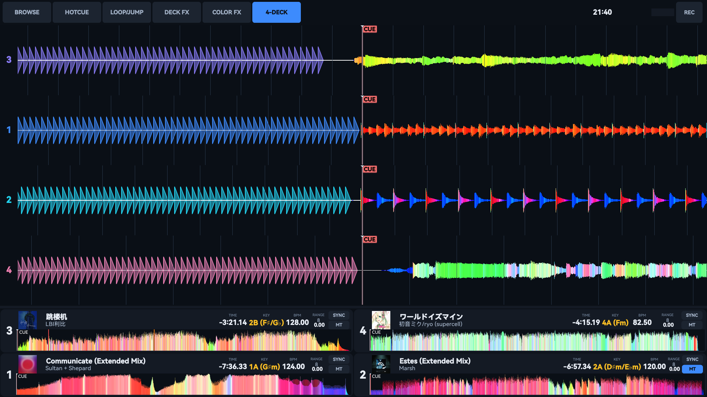

# Mixbox v2 Touchscreen

A dark, touch-first [Mixxx](https://mixxx.org) skin for all-in-one DJ units.

- Mixxx **2.5.x**, minimum window **1024x600**
- No image assets — everything is drawn by Mixxx widgets plus QSS
- Palette: dark blue-grey base with a single `#3d8bfd` accent, one hue per deck



## Install

```sh
ln -s "$PWD/MixBox" ~/.mixxx/skins/MixBox    # or: cp -r MixBox ~/.mixxx/skins/
```

Restart Mixxx, then pick **Mixbox v2 Touchscreen** in Preferences → Interface.
`~/.mixxx/skins` may itself be a symlink to a working copy; Mixxx follows it.

## Layout

```
Toolbar        view toggles | spacer | clock, rec time, VU, REC, battery
Waveform       up to 4 lanes, ordered 3-1-2-4 so decks 1/2 stay centred in 2-deck mode
Library        replaces the fx/pad row while BROWSE is on
FX / pad row   hotcues, loop, beatjump, deck FX, colour FX
Deck cards     cover, title/artist, TIME/KEY/BPM/RANGE, SYNC/MT, overview
```

## Files

| File | Role |
| --- | --- |
| `skin_preview.png` | 1920x1080 screenshot; Mixxx shows it in Preferences → Interface |
| `skin.xml` | Root layout, manifest, scheme variables |
| `style.qss` | All styling; the palette is documented in the header comment |
| `deck_info.xml` | Deck card, instanced 4x |
| `hotcue_pad.xml` | Single hotcue pad |
| `loop_control.xml`, `beatjump_control.xml` | Loop and beatjump blocks |
| `fx_slot.xml`, `colorfx_slot.xml` | Deck FX slot, quick-effect (filter) slot |

## Changing colours

QSS has no variable syntax, so the palette lives in two places — keep them in sync:

1. `style.qss` header comment — everything styled through QSS
2. `skin.xml` → `<Schemes><Scheme><SetVariable>` — the values Mixxx widgets
   take as XML properties: `WfLow`/`WfMid`/`WfHigh`/`WfPlay`/`WfBeat`,
   `CueColor`, `LoopColor`, `TextLow`, `Accent`, and per-deck `Sig1`..`Sig4`

## Skin settings

Persisted via the toolbar buttons, all under `[Skin]`: `aio_show_browser`,
`aio_show_hotcue`, `aio_show_loopjump`, `aio_show_deckfx`, `aio_show_colorfx`,
`aio_show_4decks` (2/4 deck), `show_waveforms`, `show_coverart`.

## Known limits

- 4-deck mode at 600px height leaves ~16px per waveform lane, since the deck
  cards are a fixed 100px. Collapsing them (and hiding the overview) whenever
  `aio_show_4decks` is on would be the fix.
- Knobs render as arcs only — there are no knob bitmap or SVG assets.
- Mixxx skin XML cannot open Preferences, quit, or toggle an effect's
  `enabled` state; those remain keyboard/hardware only.
- `overflow` and `row-height` in the QSS are not real Qt properties and are
  ignored, so the overview "half wave" trick does not actually clip.

## License

Creative Commons Attribution, Share-Alike 3.0 Unported — see the manifest.
